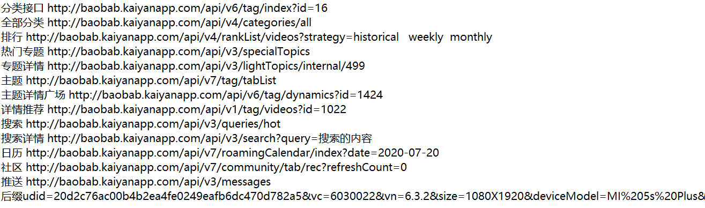

# 接口收集文档

这里面的接口仅供参考，你可以写自己想写的，**但请不要重复写自己已经写了的和正在写的**，违反即作为作弊处理，自己写的话需要自己找多个接口（一个有点糊弄人）

## 节假日 + Todo

节假日接口：http://timor.tech/api/holiday

`Todo` 的话可以使用 `wanAndroid` 的：https://www.wanandroid.com/blog/show/2442

你可以把这个设计成日历类的软件，虽然很简单，但来个自定义 `View` 就能瞬间提高难度（比如仿照小米日历，实现日历的上下拉展开、长按移动多选等 :），对于自定义 View 比较自信的同学可以选择

**该 todo 不能仿照期中考核时星球的 UI 设计**

难度：★★★★★

## Github API

github 的大部分操作都是公开了 api 的，可以在下面找到：

https://docs.github.com/cn/rest

如果感觉看不懂，可以百度一下，有很多总结了的文章，比如随便找的一篇：[github api接口](https://www.jianshu.com/p/a6779929fad2)

界面设计可以参考以下：

- 酷安上有一个，是开源的，有些地方设计的挺不错，比如看代码可以放大缩小
  - https://www.coolapk.com/apk/com.thirtydegreesray.openhub
  - https://github.com/ThirtyDegreesRay/OpenHub
- 找到个用 flutter 写的，UI 明显的苹果味：https://github.com/git-touch/git-touch

接口需要申请，但根据他们写的情况申请很快就能过

由于该接口中会用到 markdown，所以允许使用第三方展示 markdown 的库

难度：★★★☆☆  **强烈推荐**，因为它的接口设计得相当规范

## 段子乐

https://github.com/MZCretin/duanzile-open-api

类似于皮皮搞笑这样的应用，接口需要申请，根据他们写的情况，申请比较简单

由于该接口中会用到视频播放，所以允许使用第三方视频播放开源库

难度：★★★★☆

## 开眼

接口很凌乱，但能写出来一个完整的 `app`，以下给出一些其他项目，里面包含了部分接口

https://www.wanandroid.com/blog/show/2718

https://github.com/fmtjava/Jetpack_Kotlin_Eyepetizer

详细的接口分析文档：https://github.com/1136535305/Eyepetizer/wiki/开眼-API-接口分析

[LinT0T/OpenEye](https://github.com/LinT0T/OpenEye)（19级学长林潼的考核，也是我(郭) MVVM、jetpak、协程的启蒙项目）

由于该接口中会用到视频播放，所以允许使用第三方视频播放开源库

难度：★★★☆☆

## 接口大全

https://github.com/MZCretin/RollToolsApi

接口需要申请，其中它给的第一个接口是上面的段子乐，应该申请不难

## public-api-lists

找到的一个专门收集免费接口的仓库，接口很多，但大部分是国外的

https://github.com/public-api-lists/public-api-lists

## 其他接口大全

https://www.nonoas.top/archives/apishare

接口很多，可以自行发挥

# 声明

**上述 API 均来自于网络，纯属学习交流使用，不得用于商业用途！**

